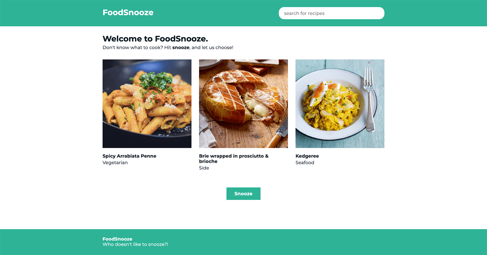

# FoodSnooze


This readme has the following content:
* How to run the project
* Architectural choices
* How to become production ready
 
## How to run the project

### Install dependencies
First step is to install the dependencies. 
Move into the root of the project folder and run the installation command: 
```
npm install
```

### Run the project
To run the application locally, by using the API provided in the documentation, use the following command:
```
npm run dev
```
The project will run on `localhost:8080`

### Run with mocked API
For this project [Mocky](https://www.mocky.io/) is being used the mock the API response, in case local testing is preferred without using the real API.  
```
npm run mock
```
The project will run on `localhost:8080`

### Run the unit tests
To run all the unit tests:
```
npm run test:unit
```

### Compiles and minifies for production
Creates a folder which you can host on your server
```
npm run build
```

### Lints and fixes files
Automatically fixes code styling based on the Airbnb config
```
npm run lint
```

### Link to API
[TheMealDB](https://www.themealdb.com/api.php)


## Architectural choices
### Editor
* **Webstorm 2019.2**: JetBrains Webstorm is my preferred editor for frontend projects. 

### Frameworks / Dependencies
* **VueJS**: Since the project at ABN will be written in VueJS, it is only logical to use it for this assignment. 
Apart from that, it is a light and intuitive framework with a fast growing community.
* **VueCLI**: This is used to create the project and to install some basic dependencies. 
This makes creating the project easier, faster and less prone to errors.
* **Babel**: Converts new Javascript syntax and uses polyfills so the code can run on older browsers. 
* **ESlint**: Checks the code in the editor for any mistakes or improvements. 
The Airbnb config is used as it is the most commonly used config. This means that other developers should not have issues when reading the code.
* **Bootstrap(css)**: All styling is done manually to show an understanding of CSS (SCSS), except the grid from Bootstrap is being used in order for efficiency. 
* **Axios**: HTTP client is widely used for its simplicity and options. It also automatically converts the response to JSON. 
* **Flush-promises**: This is used during unit testing. 
It *flushes* a pending promise meaning it will test the events after the promise. It also updates the DOM.

### Architectural design
* **ApiService**: This is the service where all the API calls are made. It can be injected in every component where it is needed.
Having all calls in one file gives a clear overview. In a larger application it makes sense to use multiple API services for different API's.
* **Environments**: There are 3 environment used in this project. 
`Dev` is used for the real API, `Mock` is used for local development to quickly change the response (also, for simulating failing calls) and `test` is used for unit tests.

### Component-reusability
* **RecipeCard**: An example of a reusable component is the RecipeCard which can be found in the components folder.
It uses props to inject data from the API which makes it dynamic and can therefore be used on multiple pages.
* **Typography**: Reusable components are also used for text. With a default slot the text is injected in the component. 
This gives the developer more options to edit the styling. For example: using a function that changes the color of the text based on the URL. 

## How to become production ready
* **CI/CD**: Setting up a pipeline to make deployments to multiple environments and automatic testing.  
* **Sanitising input fields**: Escape the user input before sending the query to the API to prevent a XSS attack.
* **Create integration tests**: Apart from the unit tests having 90%+ coverage, integration tests are needed.
This means interface/API testing as well as integration testing with back-end services.
* **Using credentials for private API calls**: Currently there are no credentials for the communication with the Back-end.
The data that is currently requested is public but private request should be handled with some sort of token (E.G. JWT).
* **Error handling**: Creating a 404 page, general error page and displaying error messages that helps the user to understand an error has occurred.
* **ARIA attributes**: Using ARIA attributes on the HTML elements to make the website more accessible for users with disabilities. 
* **Lazy loading**: Lazy loading images to improve performance. 
* **User testing**: Have real users test the application, to understand the bottlenecks of the application and improve where needed.
* **Design improvements**: Both mobile responsiveness as well as the basic design has room for improvement.  
* **Spinners**: When the API data is being fetched, there should be a spinner indicating to the user that the request is being handled.
* **Optional: TypeScript**: TypeScript can help to build a more robust codebase. 


